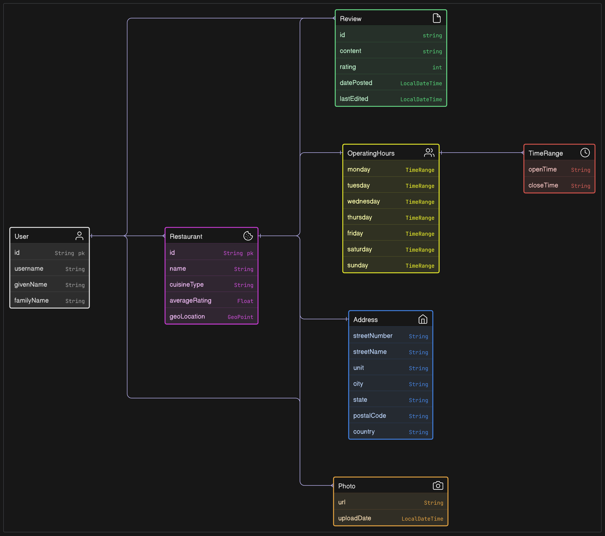
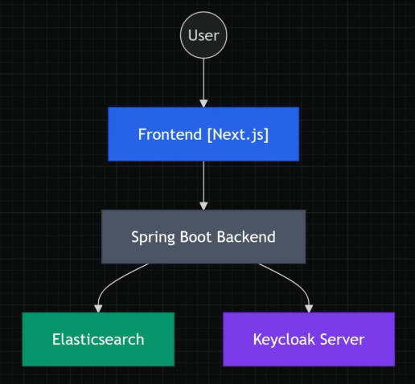

# Restaurant Review Platform

A web-based platform that enables users to discover local restaurants, read authentic review from other diners, and share their own dining experiences through detailed reviews and rating, helping others make informed decision about where to eat.

## Definitions

### Restaurant Listing

A dedicated page or entry containing essential information about a restaurant including its name, location, cuisine type, operating hours and contact details.

### Review

A user-submitter assessment of their dining experience at a specific restaurant, including detailed written feedback and a numerical rating.

### Rating

A numerical score, typically on a scale od 1-5 stars, that represents a user's overall satisfaction with their experience at a restaurant.

---

## User Stories

### **View Restaurant Details**

As a potential diner, I want to see detailed information about restaurants in my area. So that I can make an informed decision about where to eat.

Acceptance Criteria

1. Restaurant listing display name, address, cuisine type, and operating hours
2. Users can view the restaurant's average rating
3. Restaurant contact information are displayed when available
4. Photos of the restaurant are displayed when available
5. Users can see the restaurant's location on a map

### **Read Restaurant Review**

As a potential diner, I want to read reviews from other customers. So that I can learn about others's experience before visiting.

Acceptance Criteria

1. Reviews are displayed in chronological order
2. Each review shows the author's name and date posted
3. Reviews display bot written feedback and numerical rating
4. Users can sort reviews by rating or date
5. The total number of reviews is clearly visible.

### **Submit Restaurant Review**

As a restaurant customer, I want to share my dining experience through a review. So that I can help others make informed dining decisions.

Acceptance Criteria

1. Users must be logged in to submit a review
2. Review form includes a text area for written feedback
3. Users can select a rating from 1-5 stars
4. Users can submit photos with their review
5. Users cannot submit multiple reviews for the same restaurant
6. Users can edit their review within 48 hours of posting

---

## Bonus Features

### **Enhanced Review Functionality**

As a reviewer, I want to rate specific aspects of my dining experience. So that I can provide more detailed feedback.

Acceptance Criteria

1. Users can rate food quality, service, ambiance, and value separately
2. Each aspect has its own 1-5 star rating
3. Users can add tags to their review (e.g. "great for dates", "family-friendly")
4. The platform calculates and displays average ratings for each aspect.

---

## Domain Overview

Entities we need:

- User
- Restaurant
- Review
- Photo
- Address
  - Geolocation
- OperatingHours

### ER Diagram

- The `User` can create restaurants and write.
- Each `Restaurant` has core details, rating, photos, and nested structures.
- A `Review` includes content, 1-5 star rating, and photos within 48hr edit window.
- Supporting objects like `Address` and `OperatingHours` help organize data.

### REST API Overview

- The REST API allows for managing Restaurants, Reviews, and Photos.

---

## UI Overview

- Homepage displays resturant cards with images, ratings, and cuisine types
- Restaurant details page shows location map, reviews, and submission form.
- Search functionality supports seach and filtering by rating.
- Users can submit reviews with ratings, text, and photos.
- Restaurant owners can add new establishments via a dedicated form.

## Project Architecture Overview

- Frontend uses Next.js to handle UI and client-side interactions.
- Backend uses **Spring Boot** for business logic and API endpoints.
- **Elasticsearch** stores data and enables advanced search features.
- **Keycloak** manages authentication using OAuth2 and OpenID Connect.

### Project In Brief

- Platform enables restaurant discovery and reviews
- Implements core features: search, auth, and image handling
- Focuses on advanced search functionality
- Includes geospatial capailities

---

## Spring Boot Module Structure

1. Create a new Spring Boot project
2. Understanding the initial project structure
3. Setting up Elasticsearch with Docker
4. Installing and configuring Kibana
5. Setting up Keycloak with Docker
6. Configure Mapstruct with Lombok
7. Running the frontend application

---

## Project Structure

A new Spring Boot Project is created using [spring-initialzr](https://start.spring.io/)

- Project follows standard **Spring Boot** directory structure
- Selected *Java 21*, Maven and Jar packaging format
- Spring Boot version: `3.5.0`
- `pom.xml` contains our selected dependencies:
  - Spring Web
  - Spring Security
  - OAuth2 Resource Server
  - Spring Data Elasticsearch (Access+Driver)
  - Validation
  - Lombok
- Main application class serves as the entry point
- Resource files are stored in `src/main/resources`

## Docker Compose Setup

- Docker Compose configured to run Elasticsearch and Kibana locally
- Elasticsearch runs on [port 9200](http://localhost:9200), Kibana on [port 5601](http://localhost:5601)
- Application configured to connect Elasticsearch
- Data persists through container restarts using Docker volumes

---

## Elasticsearch & Kibana

- An **index** is a collection of documents uniquely identified by a name or an alias.
- Each document is a collection of fields, which each have their own data type.
- Kibana's **Index Management** features are an easy, convenient way to manage your cluster’s indices, data streams, index templates, and enrich policies.

  - <http://localhost:5601/app/home#/> > Management > Stack Management > Index Management
  - Explore available index actions & management features.

---

### Author

- [Soumo Sarkar](https://linkedin.com/in/soumo-sarkar)
